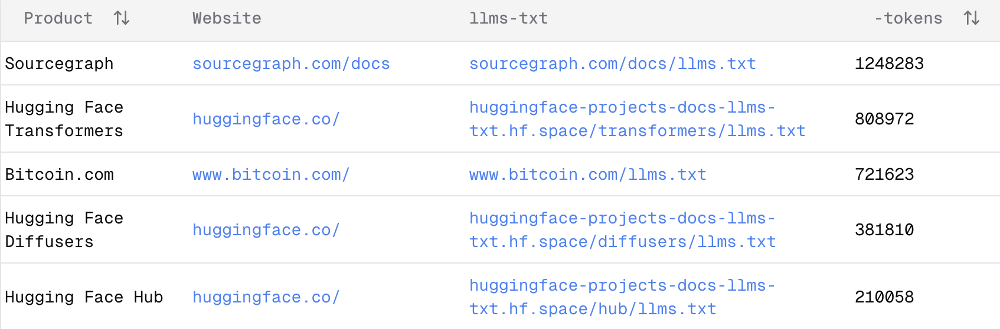
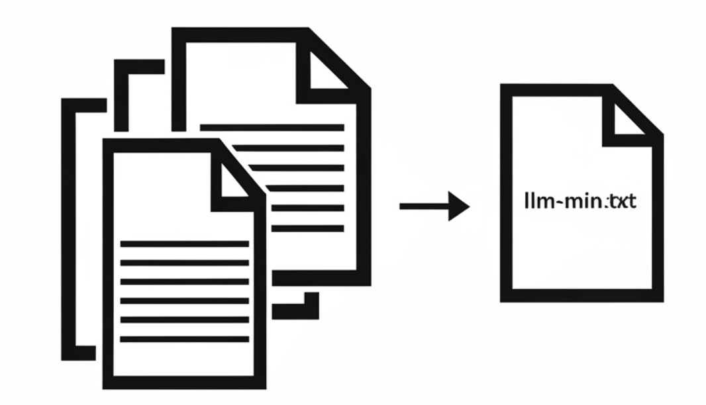
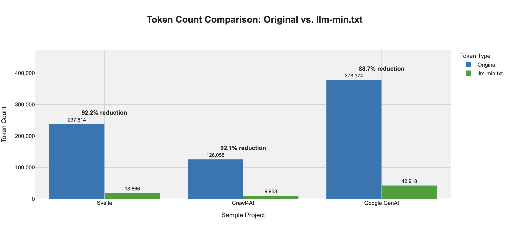

# llm-min.txt: Min.js Style Compression of Tech Docs for LLM Context 🤖

[](https://opensource.org/licenses/MIT)
[](https://www.python.org/downloads/)
[](https://console.cloud.google.com/apis/api/gemini.googleapis.com/overview?project=llm-min)

## 📜 Table of Contents

- [llm-min.txt: Min.js Style Compression of Tech Docs for LLM Context 🤖](#llm-mintxt-minjs-style-compression-of-tech-docs-for-llm-context-)
  - [📜 Table of Contents](#-table-of-contents)
  - [What is `llm-min.txt` and Why is it Important?](#what-is-llm-mintxt-and-why-is-it-important)
  - [Understanding `llm-min.txt`: A Machine-Optimized Format 🧩](#understanding-llm-mintxt-a-machine-optimized-format-)
  - [Does it Really Work? Visualizing the Impact](#does-it-really-work-visualizing-the-impact)
  - [Quick Start 🚀](#quick-start-)
  - [Output Directory Structure 📂](#output-directory-structure-)
  - [Choosing the Right AI Model (Why Gemini) 🧠](#choosing-the-right-ai-model-why-gemini-)
  - [How it Works: A Look Inside (src/llm\_min) ⚙️](#how-it-works-a-look-inside-srcllm_min-️)
  - [What's Next? Future Plans 🔮](#whats-next-future-plans-)
  - [Common Questions (FAQ) ❓](#common-questions-faq-)
  - [Want to Help? Contributing 🤝](#want-to-help-contributing-)
  - [License 📜](#license-)

---

## What is `llm-min.txt` and Why is it Important?

If you've ever used an AI coding assistant (like GitHub Copilot, Cursor, or others powered by Large Language Models - LLMs), you might have noticed they sometimes don't know about the very latest updates to programming tools or libraries. This is because AI models have a "knowledge cutoff" – a point in time beyond which they haven't learned new information. Software, especially new libraries, changes quickly, and these changes can break your code if the AI isn't aware of them.

Several great ideas have tried to solve this problem:
- <a href="https://llmstxt.org/"></a> [llms.txt](https://llmstxt.org/)
  This is a community project where people create special text files (`llms.txt`) that provide up-to-date information about software libraries for AIs.

- <a href="https://context7.com/"></a> [Context7](https://context7.com/)
  This is a service that helps give AIs the right information (context) they need, often by summarizing documentation.

These are helpful, but they have some challenges:
- `llms.txt` files can get very, very long. Some are over **800,000** "tokens" (think of tokens as pieces of words). That's a lot for an AI to read!
  
    
    
    Many smaller `llms.txt` files are just links to the official websites, which the AI still needs to go and read. Even the full text versions (usually as `llms-full.txt`)can be too big for some AIs to handle all at once. It's also not always clear if these files are the absolute latest version.

- `Context7` is a bit like a "black box" – you can use it, but it's not always clear exactly how it's picking and choosing information for the AI. It also mainly works with code on GitHub or existing `llms.txt` files, not just any software package.

**So, how can we make this better?**



Think about `min.js` files in web development. These are JavaScript files that have had all the unnecessary bits (like comments and spaces) removed. They're hard for humans to read, but computers understand them perfectly, and they're much smaller.

`llm-min.txt` takes a similar idea for software documentation. Instead of giving an AI a huge, verbose manual, we use another AI to read the manual and create a super-condensed, structured summary. This summary, the `llm-min.txt` file, captures only the most important information the AI assistant needs to understand how to use a library. It's designed for AIs to read, not humans.

Modern AIs are surprisingly good at this! They can figure out a very short and efficient way to write down the key facts.

---
## Understanding `llm-min.txt`: A Machine-Optimized Format 🧩

The `llm-min.txt` file is designed for **maximum compactness and efficient machine parsing**, not direct human reading. It uses a specific structure based on positional JSON arrays:

1.  **Header Line (`#META#...`):** A single line identifying the library (`L:`), version (`V:`), and generation timestamp (`D:`).
    *   Example: `#META#L:example-lib#V:1.0#D:2024-05-26T10:00:00Z`

2.  **Schema Definition Line (`#SCHEMA#...`):** **CRITICAL!** This single line defines the *meaning* of each position within the subsequent data arrays. It acts as the key for parsing the rest of the file.
    *   It defines mappings for the main AIU array (e.g., `A:id;B:typ;...`) and nested arrays for inputs (`IN:`), outputs (`OUT:`), and relationships (`REL:`).
    *   The letters (`A`, `B`, `a`, `b`, etc.) are placeholders in the schema; **the position (index) is what matters.** Index 0 corresponds to the first field defined (e.g., `A:id`), index 1 to the second (e.g., `B:typ`), and so on.
    *   Example: `#SCHEMA#A:id;B:typ;C:name;D:purp;E:in;F:out;G:use;H:rel;I:src#IN:a:p;b:t;c:d;d:def;e:ex#OUT:f:f;g:t;h:d#REL:i:id;j:typ#`

3.  **AIU List (Lines after Schema):** The remainder of the file consists of lines, each being a standard JSON array literal representing one "Atomic Information Unit" (AIU).

**What are Atomic Information Units (AIUs)?**

Think of an AIU as a tiny, focused data record about one specific aspect of the library (a function, feature, pattern, etc.). In this format, each AIU is represented by a single JSON array.

**AIU Array Format:**

*   Each AIU is a JSON array like `["id1", "Feat", "FeatureName", ...]`.
*   The meaning of each element is determined *solely by its position (index)* according to the `#SCHEMA#` line.
*   For example, using the schema above:
    *   Index 0 (`A:id`): The AIU's unique ID (String).
    *   Index 1 (`B:typ`): The AIU's type (String, e.g., "Func", "Feat").
    *   Index 4 (`E:in`): An array of nested arrays, each representing an input parameter `[[p, t, d, def, ex], ...]`. The meaning of `p`, `t`, `d`, etc. is defined by `IN:` in the schema.
    *   Index 7 (`H:rel`): An array of nested arrays for relationships `[[id, typ], ...]`, defined by `REL:`.
*   Absent optional values (like default values for parameters) are represented by JSON `null`. Empty strings are `""`.

**A Quick Look at the Format:**

Here's a simplified example using the new positional format:

```text
#META#L:example-lib#V:1.0#D:2024-05-26T10:00:00Z
#SCHEMA#A:id;B:typ;C:name;D:purp;E:in;F:out;G:use;H:rel;I:src#IN:a:p;b:t;c:d;d:def;e:ex#OUT:f:f;g:t;h:d#REL:i:id;j:typ#
["greet_func","Func","greet","Greets a user.",[["name","str","User\\'s name.",null,"Alice"]],[["message","str","The greeting."]],"greet(name=\\'World\\')",[], "chunk_1"]
["config_obj","CfgObj","AppConfig","Application configuration.",[["debug_mode","T","Enable debug.", "F", "T"]],[],"AppConfig(debug_mode=True)", [], "chunk_2"]
```

*   The **Header** (`#META#`) provides basic metadata.
*   The **Schema** (`#SCHEMA#`) is the **essential key** to interpret the arrays below it.
*   The subsequent lines are **AIU arrays**:
    *   The first array describes `greet_func`. We know "Func" is the type because it's at index 1, and the schema maps index 1 (`B`) to `typ`. The input parameter `name` is derived from the nested array at index 4 (`E`), whose structure is defined by `IN:`.
    *   The second array describes `config_obj`. Its type `CfgObj` is at index 1. The `debug_mode` parameter uses "T" / "F" for boolean values as specified in the guideline.

This highly compressed, positional format minimizes token count, making it extremely efficient for LLMs to process once they understand the schema.

The exact parsing rules and abbreviations are detailed in the `llm-min-guideline.md` file generated alongside `llm-min.txt`.

---

## Does it Really Work? Visualizing the Impact

`llm-min` is designed to dramatically reduce the token count of library documentation, making it significantly more efficient for AI models to process. The chart below showcases the typical compression results for a few Python libraries, comparing the token count of the original documentation (`llm-full.txt`) against the `llm-min.txt` version generated by `llm-min`.



This visualization demonstrates substantial token reductions, often in the range of 90-95% or even higher. This compactness, combined with the structured AIU format, enables AI coding assistants to ingest and understand library information much faster and more effectively. They get the core facts without wading through extensive prose.

For instance, in the `sample/crawl4ai/` folder, you can find:
*   `sample/crawl4ai/llm-full.txt`: The original, full documentation.
*   `sample/crawl4ai/llm-min.txt`: The compressed version created by `llm-min`.
*   `sample/crawl4ai/llm-min-guideline.md`: A copy of the instruction sheet the AI used to create the `llm-min.txt` file.
  
Compressed file are usually near 10,000 tokens, which are usually enough for most LLM to handle.

** How to use it?**

---

## Quick Start 🚀

Ready to try it out? Here's how:

**1. Installation:**

*   **If you just want to use `llm-min` (Recommended):**
    Open your terminal or command prompt and type:
    ```bash
    pip install llm-min

    # This next command installs small browser tools llm-min needs to read websites
    playwright install
    ```
    (`pip` is Python's package installer. If you don't have Python or pip, you might need to install Python first from [python.org](https://www.python.org/downloads/)).

*   **If you want to contribute to `llm-min` or modify its code:**
    ```bash
    # First, get the code (if you haven't already)
    # git clone https://github.com/your-repo/llm-min.git
    # cd llm-min

    # Set up a virtual environment (good practice for Python projects)
    python -m venv .venv
    source .venv/bin/activate # On Windows, use: .venv\Scripts\activate

    # Install the project and its tools using 'uv' (a fast Python package manager)
    uv sync
    uv pip install -e .

    # Optional: For checking your code quality before sharing
    # uv pip install pre-commit
    # pre-commit install
    ```

**2. Set Up Your Gemini API Key:** 🔑

`llm-min` uses Google's Gemini AI model to understand and compress the documentation. To use it, you'll need a Gemini API Key.

*   **Recommended:** The easiest way is to set an "environment variable" named `GEMINI_API_KEY` with your key value. `llm-min` will find it automatically. How to set environment variables depends on your operating system (a quick web search for "set environment variable macos/windows/linux" will show you how).
*   **Alternatively:** You can type your API key directly into the command when you run `llm-min` using the `--gemini-api-key` option (see examples below).

You can get a Gemini API key from the [Google AI Studio](https://aistudio.google.com/app/apikey) or Google Cloud Console.

**3. Create Your First `llm-min.txt` (Using the Command Line):** 💻

You'll tell `llm-min` what documentation to process. You can give it:
*   A Python package name (e.g., "requests").
*   A direct web address (URL) to online documentation.
*   A folder on your computer containing documentation files.

**Input Options (Choose one):**

| Option           | Short | Type      | What it does                                                                  |
|------------------|-------|-----------|-------------------------------------------------------------------------------|
| `--package`      | `-pkg`| `TEXT`    | Name of a Python package (e.g., "requests", "typer").                         |
| `--doc-url`      | `-u`  | `TEXT`    | Web address of documentation (e.g., "https://docs.python.org/3/").          |
| `--input-folder` | `-i`  | `DIRECTORY`| Path to a local folder with doc files (like .md, .txt).                    |

**Common Settings:**

| Option              | Short | Type      | What it does                                                                 |
|---------------------|-------|-----------|------------------------------------------------------------------------------|
| `--output-dir`      | `-o`  | `DIRECTORY` | Where to save the generated files (default is a folder named `llm_min_docs`).|
| `--output-name`     | `-n`  | `TEXT`    | Give a custom name for the subfolder inside `output-dir`.                    |
| `--max-crawl-pages` | `-p`  | `INTEGER` | Max web pages to read (default: 200; 0 means no limit).                      |
| `--max-crawl-depth` | `-D`  | `INTEGER` | How many links deep to follow on a website (default: 2).                     |
| `--chunk-size`      | `-c`  | `INTEGER` | How much text to give the AI at once (default: 600,000 characters).          |
| `--gemini-api-key`  | `-k`  | `TEXT`    | Your Gemini API Key (if not set as an environment variable).                 |
| `--gemini-model`    | `-m`  | `TEXT`    | Which Gemini model to use (default: `gemini-2.5-flash-preview-04-17`).       |
| `--verbose`         | `-v`  |           | Show more detailed messages while it's working.                              |

**Examples:**

*   Process the Python package `typer`, read up to 50 web pages, and save to a folder called `my_docs`:
    ```bash
    llm-min -pkg "typer" -o my_docs -p 50 --gemini-api-key YOUR_API_KEY_HERE
    ```

*   Process the FastAPI documentation from its website, read up to 50 pages, and save to `my_docs`:
    ```bash
    llm-min -u "https://fastapi.tiangolo.com/" -o my_docs -p 50 --gemini-api-key YOUR_API_KEY_HERE
    ```

*   Process documentation files from a local folder named `./docs` and save to `my_docs`:
    ```bash
    llm-min --input-folder "./docs" -o my_docs --gemini-api-key YOUR_API_KEY_HERE
    ```

**4. Using `llm-min` in Your Own Python Code:** 🐍

You can also use `llm-min` directly within your Python scripts.

```python
from llm_min import LLMMinGenerator
import os

# Settings for the AI (optional, llm-min will use defaults if you don't specify)
llm_config = {
    "api_key": os.environ.get("GEMINI_API_KEY"), # Tries to get key from environment
    "model_name": "gemini-2.5-flash-preview-04-17", # The recommended AI model
    "chunk_size": 1000000, # How much text to process at a time
    "max_crawl_pages": 200, # Max web pages to read
    "max_crawl_depth": 3,   # How deep to follow links
}

# Create the llm-min generator
# Output files will go into a folder like ./my_output_docs/requests/
generator = LLMMinGenerator(output_dir="./my_output_docs", llm_config=llm_config)

# Example: Create llm-min.txt for the 'requests' Python package
try:
    generator.generate_from_package("requests")
    print("✅ Successfully created documentation for 'requests'!")
except Exception as e:
    print(f"❌ Oh no! Something went wrong with 'requests': {e}")

# Example: Create llm-min.txt from a website URL
try:
    generator.generate_from_url("https://bun.sh/llms-full.txt")
    print("✅ Successfully created documentation for 'https://bun.sh/llms-full.txt'!")
except Exception as e:
    print(f"❌ Oh no! Something went wrong with 'https://bun.sh/llms-full.txt': {e}")
```

This Python example shows how to set up the generator, give it some settings, and then tell it to create `llm-min.txt` files from either a package name or a URL.

For a full list of all command-line options, type:
```bash
llm-min --help
```
---

## Output Directory Structure 📂

When `llm-min` finishes, it will create a folder structure like this to keep things tidy:

```text
your_chosen_output_dir/
└── name_of_package_or_website/
    ├── llm-full.txt             # The original, complete text it read
    ├── llm-min.txt              # The super-compact, positional array summary for AIs
    └── llm-min-guideline.md     # The **parsing guide** explaining the llm-min.txt format and schema
```

So, if you ran `llm-min -pkg "requests" -o my_llm_docs`, you'd find:

```text
my_llm_docs/
└── requests/
    ├── llm-full.txt
    ├── llm-min.txt
    └── llm-min-guideline.md
```
**Important:** The `llm-min-guideline.md` is crucial for understanding how to correctly interpret the data within the corresponding `llm-min.txt` file.

---

## Choosing the Right AI Model (Why Gemini) 🧠

`llm-min` uses Google's Gemini family of AI models. While you *can* try to tell it to use a different Gemini model with the `--gemini-model` option, we **strongly suggest sticking with the default: `gemini-2.5-flash-preview-04-17`**.

Here's why this model is a good choice for `llm-min`:
1.  **It's Smart:** This model is good at understanding complex text and figuring out the important parts, which is exactly what we need for summarizing documentation accurately.
2.  **It Can Read A Lot:** It has a "long context window" (1 million tokens!), meaning it can read and remember a very large amount of documentation at once. This is super helpful because many software manuals are quite long.
3.  **It's Cheap (Compared to other models)**: It's one of the cheaper models, so it won't cost you a fortune to use it.

Using this default model gives a good balance of quality, speed, and cost for creating these compact `llm-min.txt` files.

---

## How it Works: A Look Inside (src/llm_min) ⚙️

Here's a simplified look at what happens when you run `llm-min`:

1.  **Input:** You provide instructions via the command line (like `-pkg "requests"`) or by calling `llm-min` functions in your Python code.
2.  **Documentation Gathering:** Based on your input, `llm-min` finds the relevant documentation (from PyPI, web crawl, or local files).
3.  **Text Processing:** The gathered text is cleaned and split into manageable chunks. The original text is saved as `llm-full.txt`.
4.  **Sequential AI Analysis (Gemini):**
    *   **Chunk 1 (Extraction):** The first chunk is sent to the Gemini AI model with the `FRAGMENT_GENERATION_PROMPT_TEMPLATE`. The AI is instructed to extract key information and format it into **lines that attempt to be the positional JSON arrays** (AIUs) according to the schema defined in the prompt. The AI assigns a unique ID to each AIU line and tags it with the chunk ID (`src`).
    *   **Chunk 2+ (Merge & Refine):** For subsequent chunks, the **raw text lines generated from the previous step** (`accumulated_aiu_lines_str`) and the new text chunk are sent to the Gemini AI with the `AIU_MERGE_PROMPT_TEMPLATE`. The AI is instructed to:
        *   Analyze both the existing AIU lines and the new chunk.
        *   Identify overlapping concepts.
        *   **Reuse existing IDs** if updating an AIU, or **generate new unique IDs** for new concepts.
        *   Merge and refine information (purpose, inputs, outputs, usage, relationships).
        *   Update the source (`src`) field based on whether the AIU was new/modified or largely unchanged.
        *   Consolidate redundant information and remove irrelevant lines.
        *   Ensure relationships (`rel`) refer to IDs present in the *newly generated output list*.
        *   Output a *new* set of lines attempting the same positional JSON array format.
    *   This merge process repeats for all remaining chunks, with the output of one step becoming the input for the next.
5.  **Final Assembly:** The raw text lines produced after processing the final chunk are assembled into the `llm-min.txt` file. The `#META#` and `#SCHEMA#` lines are prepended, defining the library metadata and the **critical parsing key** for the AIU array lines that follow. Minimal processing (like whitespace cleaning) occurs in the Python code; the structure and content rely heavily on the LLM following the prompt instructions.

**Workflow Overview:**

```text
+--------------+      +-------------+      +---------------+      +--------------------+      +-----------------+      +---------------------+      +-----------------+
| User Input   | ---> | Doc         | ---> | Text          | ---> | Gemini AI          | ---> | Raw AIU Lines   | ---> | Gemini AI           | ---> | Final Raw       |
| (CLI/Python) |      | Gathering   |      | Processing    |      | (Chunk 1: Extract) |      | (String)        |      | (Chunk 2+: Merge)   |      | AIU Lines       |
+--------------+      +-------------+      +---------------+      +--------------------+      +-----------------+      +---------------------+      +-----------------+
                                                                                                                                                     |
                                                                                                                                                     V
                                                                                                                                               +---------------+
                                                                                                                                               | llm-min.txt   |
                                                                                                                                               | (#META# +     |
                                                                                                                                               | #SCHEMA# +    |
                                                                                                                                               | Final Lines)  |
                                                                                                                                               +---------------+
```

To make things efficient, especially the web crawling and AI communication parts, `llm-min` uses asynchronous operations. This means it can perform multiple tasks concurrently (like fetching several web pages or waiting for AI responses) without getting stuck waiting for one single step to finish, speeding up the overall process. 💨

The core logic for this process lives within the `LLMMinGenerator` class and the `compact_content_to_structured_text` function in the `src/llm_min/` directory.

---

## What's Next? Future Plans 🔮

We're excited about the potential of `llm-min` and have a few ideas for where it could go next. These are still under consideration, and we'd love community feedback!

*   **A Public `llm-min.txt` Repository?** 🌐
    Ideally, library authors would include an `llm-min.txt` file with their releases. Since that might take time, we've considered creating a central, public website (perhaps like `llms.txt` or `Context7`) where the community could share and find `llm-min.txt` files for various libraries. However, maintaining quality, handling different versions, and managing potential costs are significant challenges to figure out.

*   **Inferring Documentation from Code?** 💻
    Could `llm-min` analyze the source code itself (using tools like Abstract Syntax Trees - ASTs) to automatically generate documentation summaries? This is an exciting avenue, though early experiments haven't been fully successful yet. It's a complex task, but potentially very powerful.

*   **What About an MCP Server?** 🤔
    While technically possible, running `llm-min` as a Model Control Protocol (MCP) server doesn't feel like the right fit right now. A key goal of `llm-min` is to provide reliable, static context (the `.txt` file) to reduce the uncertainty sometimes found with dynamic AI interactions. A server model might reintroduce some of that uncertainty.

These are just initial thoughts, and the direction will depend on user needs and contributions!

---

## Common Questions (FAQ) ❓

Here are answers to some questions you might have:


**Q: Do I need to use a reasoning model to generate an `llm-min.txt` file?** 🧠

A: Yes, you need a reasoning model to generate an `llm-min.txt` file. This task involves a lot of abstract thinking, so it's not something a simple LLM without reasoning capabilities can do.

**Q: Does `llm-min.txt` ensure no information is lost?** 🧠

A: No, as llm-min is a compression tool, it is not possible to ensure no information is lost. However, it is designed to be a comprehensive summary of the documentation that can be used by AI assistants to answer questions about the library.

**Q: Why does generating an `llm-min.txt` file take some time?** 🕒

A: It's a multi-step process: finding documentation, potentially crawling many web pages (which depends on website speed and network conditions), processing potentially large amounts of text, and interacting with the powerful Gemini AI model (which has its own processing time). While `llm-min` uses asynchronous operations to speed things up where possible, analyzing and summarizing extensive documentation inherently takes a few minutes. The upside is that once generated, the compact `llm-min.txt` file is much faster for AI assistants to use.

**Q: How much does it typically cost to generate one `llm-min.txt` file?** 💰

A: This depends directly on the amount of text processed by the Gemini API. For a moderately sized library, the cost might fall roughly between **$0.10 and $1.00 USD**. This is just an estimate. Factors like the total size of the documentation, the complexity of the text, and the specific AI model used can influence the final cost. Always refer to the official [Google Cloud AI pricing page](https://cloud.google.com/vertex-ai/pricing#gemini) for the latest details on Gemini API usage costs.

**Q: Did you vibe code this project?** 🎥

A: Yes, I did. This project was developed using [Roocode](https://roocode.com/) with my custom configuration called [Rooroo](https://github.com/marv1nnnnn/rooroo).

---

## Want to Help? Contributing 🤝

We'd love your help to make `llm-min` better! 🎉 Feel free to open issues on GitHub if you find bugs or have ideas. Pull requests (code contributions) are also very welcome.

Some areas where we'd especially appreciate help:
*   Making it even better at finding documentation automatically.
*   Improving the way it compresses and structures the information.
*   Adding support for more AI models or better ways to talk to them.
*   Writing more tests to make sure everything works reliably.

---

## License 📜

This project is licensed under the MIT License. You can see the full details in the `LICENSE` file.
